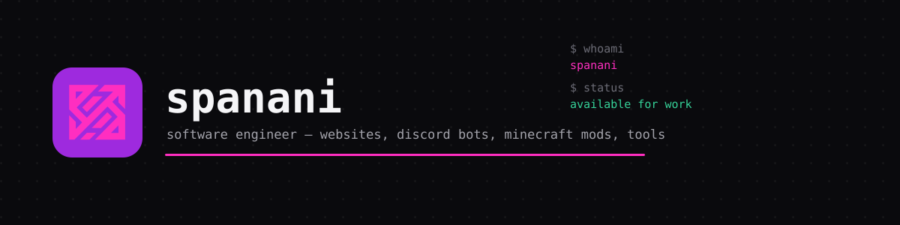

  

  

    
    
    
    
  

## About

I'm spanani — a solo software engineer. I design, write, and ship
everything myself: websites, Discord bots, Minecraft mods and plugins,
Discord server setups, and the small precise tools in between. No
agency layers, no account managers — you talk to the person actually
writing the code.

This repo is both my portfolio and the site itself: [spanani.de](https://spanani.de)
is a fully static build — plain HTML, CSS, and vanilla JavaScript, no
framework, no build step, no backend — deployed on GitHub Pages from
`main`, with `spanani.de` set as the custom domain via `CNAME`.

**Looking to hire me?** → [spanani.de/services](https://spanani.de/services) · [spanani.de/contact](https://spanani.de/contact)

## Structure

| Page | What's there |
|---|---|
| `/` | Homepage — name-first hero with a code snippet, a grid of what I build, featured projects, and a way to get in touch. |
| `/projects` | Every side project in one place: the clock, the Rust raid calculator, the tennis tracker, and Rust Empire. |
| `/services` | What I take on for other people: Discord bots, Minecraft mods/plugins, server setup, websites, custom tools. No prices listed — every project's different, message me and we'll figure it out. |
| `/contact` | Discord and email, both click-to-copy. No contact form, because there's nothing behind it to send one to. |
| `/impressum`, `/datenschutz` | The German legal pages a site like this needs. |
| `/clock` | A network-synced clock: digital and analog dial, a 3D-globe world clock, a stopwatch, a timer, settings that stick via `localStorage`. |
| `/rust` | A raid-cost calculator for the game Rust. Sulfur, explosives, structure tiers, the lot. |
| `/tennis` | An offline-first match tracker built mobile-first. |
| `/rustempire` | A separate Rust server-management tool, kept in its own corner of this repo. |

## Design

Black, white, one purple accent. Dark by default, flips to light
if your system asks for it. No gradients, no animated backgrounds —
the only visual flourish on the homepage is a static code snippet,
because that's what actually proves I can build something.

`/rust` and `/tennis` run their own independent color systems and
aren't affected by any of this.

**Fonts:** DM Mono for the homepage headline and anything that's
actually data (timestamps, digits, labels), Space Grotesk for every
other heading, Inter for body copy. All self-hosted under
`/assets/fonts` — no Google Fonts, no third-party font requests.
Licensed under the SIL Open Font License 1.1 (`assets/fonts/OFL.txt`).

## Notes

- No backend, no forms that go anywhere, no server-side code of any
  kind — everything you see is exactly what gets served.
- `/clock` pings a couple of public time APIs to stay in sync and
  falls back to your device's own clock if none of them respond.
- Settings (clock display, accent color) persist per-browser via
  `localStorage`.
- Don't delete `CNAME` — GitHub Pages needs it to keep serving the
  custom domain.

## License

MIT — see [`LICENSE.txt`](LICENSE.txt). The self-hosted fonts are
licensed separately under the SIL Open Font License 1.1
(`assets/fonts/OFL.txt`), not MIT.
